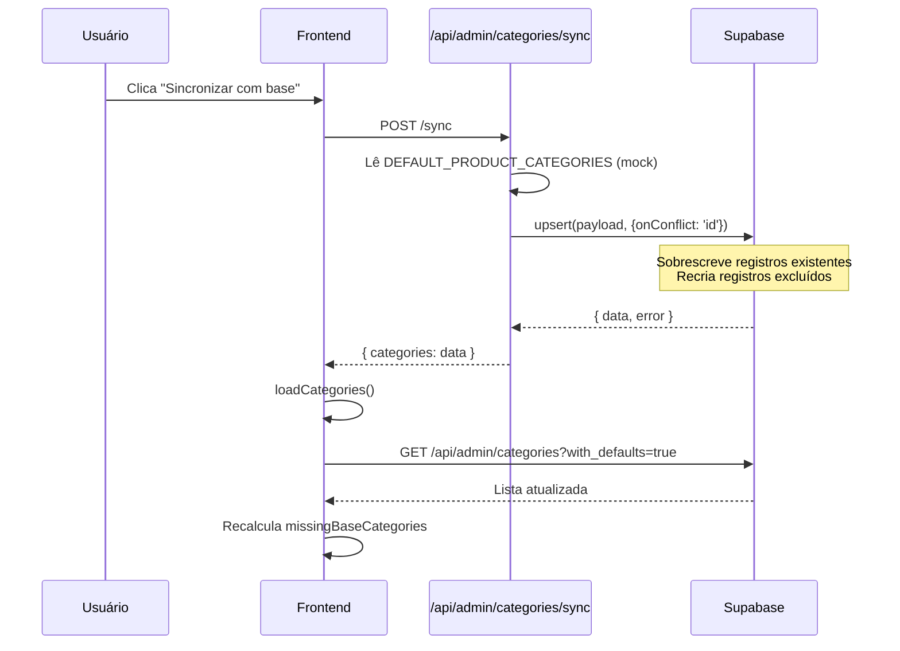

# Diagnóstico: Sistema de Categorias - AquifazV3

**Data:** 11 de novembro de 2025  
**Escopo:** Análise completa do fluxo de categorias (criação, edição, exclusão, sincronização)

---

## 1. Schema Real (Migrations do Supabase)

### Tabela `product_categories`

**Localização:** `supabase/migrations/20241107000001_admin_setup.sql:288-298`

```sql
CREATE TABLE IF NOT EXISTS product_categories (
  id TEXT PRIMARY KEY,
  name TEXT NOT NULL,
  description TEXT,
  icon TEXT,
  image_url TEXT,
  active BOOLEAN DEFAULT true,
  sort_order INTEGER DEFAULT 0,
  created_at TIMESTAMP WITH TIME ZONE DEFAULT TIMEZONE('utc', NOW()),
  updated_at TIMESTAMP WITH TIME ZONE DEFAULT TIMEZONE('utc', NOW())
);
```

**Coluna adicional:** `storage_path TEXT` (adicionada em `20241108142000_storage_buckets_and_columns.sql:127`)

### Relação Produto ↔ Categoria

**Localização:** `supabase/migrations/20241107000001_admin_setup.sql:16`

```sql
CREATE TABLE IF NOT EXISTS products (
  ...
  category TEXT NOT NULL,  -- Relação 1:N (um produto → uma categoria)
  ...
);
```

**Índice:** `CREATE INDEX IF NOT EXISTS idx_products_category ON products(category);`

### Observações Críticas

- ❌ **NÃO existe soft delete** (`deleted_at` não está presente)
- ✅ Exclusão é **hard delete** (remoção física do registro)
- ✅ Relação é **1:N** via coluna `category` (TEXT) em `products`
- ❌ **NÃO existe tabela pivô** para multi-categoria

---

## 2. Arquivos e Fluxos Mapeados

### 2.1 Frontend (Admin UI)

**Arquivo:** `app/admin/categories/page.tsx`

| Função | Linha | Comportamento |
|--------|-------|---------------|
| `loadCategories()` | 65-80 | `GET /api/admin/categories?with_defaults=true` |
| `handleSubmit()` | 122-162 | `POST /api/admin/categories` (criar) ou `PUT /api/admin/categories/{id}` (editar) |
| `handleToggleActive()` | 164-181 | `PUT /api/admin/categories/{id}` com `active: !category.active` |
| `handleDelete()` | 183-202 | `DELETE /api/admin/categories/{id}` |
| `handleSyncDefaults()` | 204-220 | `POST /api/admin/categories/sync` |

**Estado "pendente":** Calculado em `missingBaseCategories` (linhas 46-52)
```tsx
const missingBaseCategories = useMemo(
  () =>
    DEFAULT_PRODUCT_CATEGORIES.filter(
      (base) => !categories.some((category) => category.id === base.id)
    ),
  [categories]
)
```

**Exibição:** Linha 284 (`{missingBaseCategories.length}`)

### 2.2 Backend (APIs)

#### GET `/api/admin/categories`
**Arquivo:** `app/api/admin/categories/route.ts:34-68`
- Busca todas categorias do Supabase (`product_categories`)
- Se retornar vazio **E** `with_defaults=true`, retorna `DEFAULT_PRODUCT_CATEGORIES` do mock

#### POST `/api/admin/categories`
**Arquivo:** `app/api/admin/categories/route.ts:70-120`
- Cria nova categoria via `insert()`
- Gera `id` com `slugifyId()` se não fornecido

#### PUT `/api/admin/categories/{id}`
**Arquivo:** `app/api/admin/categories/[id]/route.ts:64-157`
- Atualiza categoria existente
- **Se não existir no banco**, sincroniza da base (`DEFAULT_PRODUCT_CATEGORIES`) antes de atualizar
- Se `id` mudar, atualiza também a coluna `category` em `products` (linha 144-147)

#### DELETE `/api/admin/categories/{id}`
**Arquivo:** `app/api/admin/categories/[id]/route.ts:169-202`
- Verifica produtos vinculados (linha 173-177)
- **Bloqueia exclusão** se `count > 0`
- Caso contrário, faz **hard delete** (linha 187)

#### POST `/api/admin/categories/sync`
**Arquivo:** `app/api/admin/categories/sync/route.ts:7-40`
- Faz **upsert** de `DEFAULT_PRODUCT_CATEGORIES` (linha 20-22)
- **Usa `onConflict: 'id'`** → sobrescreve registros existentes com mesmo `id`

### 2.3 Dados Mock

**Arquivo:** `lib/content.ts:45-91`

```typescript
export const DEFAULT_PRODUCT_CATEGORIES: ProductCategory[] = [
  { id: 'cartoes', name: 'Cartões de Visita', ... },
  { id: 'banners', name: 'Banners e Fachadas', ... },
  { id: 'adesivos', name: 'Adesivos', ... },
  { id: 'print', name: 'Impressões', ... },
  { id: 'flyers', name: 'Flyers e Panfletos', ... },
]
```

---

## 3. Raiz dos Problemas

### 🔴 Problema 1: Categoria excluída volta após sincronização

**Causa raiz:**  
A função de sync (`app/api/admin/categories/sync/route.ts:20-22`) faz **upsert incondicional** de todas as categorias base:

```typescript
const { data, error } = await supabase
  .from('product_categories')
  .upsert(payload, { onConflict: 'id' })
  .select()
```

Se o usuário excluir uma categoria que existe em `DEFAULT_PRODUCT_CATEGORIES`, a sync **recria** o registro.

**Exemplo:**
1. Admin exclui categoria `id: 'print'`
2. Registro é **apagado fisicamente** do banco
3. Admin clica "Sincronizar com base"
4. Sync faz `upsert` de `'print'` → **categoria volta**

### 🔴 Problema 2: Edições somem após sincronização

**Causa raiz:**  
O payload do sync **sobrescreve todos os campos** (linha 12-20 de `sync/route.ts`):

```typescript
const payload = DEFAULT_PRODUCT_CATEGORIES.map((category, index) => ({
  id: category.id,
  name: category.name,           // ← sobrescreve nome editado
  description: category.description,
  icon: category.icon,
  image_url: category.image_url,  // ← sobrescreve imagem customizada
  active: category.active ?? true,
  sort_order: category.sort_order ?? index + 1,
  updated_at: timestamp,
  created_at: timestamp,
}))
```

Não há verificação de `updated_at` nem merge inteligente.

**Exemplo:**
1. Admin edita categoria `'cartoes'`: muda nome para "Cartões Premium"
2. Admin clica "Sincronizar com base"
3. Sync sobrescreve com `name: 'Cartões de Visita'` (valor do mock)

### 🟡 Problema 3: "1 categoria(s) pendente(s)" não atualiza

**Causa raiz:**  
O cálculo de `missingBaseCategories` depende de `categories` (estado React, linha 51).  
Após ação bem-sucedida (criar/excluir/sync), o componente chama `loadCategories()` (linha 218), mas:

1. Se a requisição demorar, o estado permanece desatualizado
2. Se houver erro de rede silencioso, o estado nunca atualiza
3. Não há **optimistic update** no cliente

**Observado no código:**  
- `handleDelete()` (linha 199): chama `loadCategories()` mas não verifica se foi bem-sucedido
- `handleSyncDefaults()` (linha 217): chama `loadCategories()` dentro do `finally`, mesmo se sync falhar

### 🔴 Problema 4: Gestão de vínculos Produto↔Categoria inexistente

**Estado atual:**
- Backend **suporta 1:N** (um produto tem uma categoria)
- Frontend **não permite**:
  - Ver produtos de uma categoria
  - Desvincular produto de categoria
  - Multi-categoria (pois o modelo não suporta)

**Bloqueio de exclusão:**  
A API bloqueia exclusão se houver produtos vinculados (`[id]/route.ts:173-178`), mas:
- Admin **não vê quais produtos** estão vinculados
- Admin **não pode desvincular** para depois excluir

---

## 4. Fluxo Atual de Sincronização (Detalhado)



**Problema:** O `upsert` é **destrutivo e incondicional**.

---

## 5. Estrutura de Dados em `ProductCategory` (TypeScript)

**Arquivo:** `lib/types.ts:201-215`

```typescript
export interface ProductCategory {
  id: string
  name: string
  description?: string
  icon?: string
  image_url?: string
  storage_path?: string
  accent_color?: string        // ← Não existe no banco
  active?: boolean
  sort_order?: number
  created_at?: string
  updated_at?: string
}
```

**Divergências:**
- `accent_color` existe no tipo TS mas **não existe coluna no banco**
- `storage_path` existe no banco mas não está em `DEFAULT_PRODUCT_CATEGORIES`

---

## 6. Comportamento de Exclusão (Estado Atual)

### Fluxo de DELETE

```typescript
// app/api/admin/categories/[id]/route.ts:169-202
export async function DELETE(_request: NextRequest, context: RouteContext) {
  await requireAdmin()
  const { id } = await context.params
  const supabase = await createClient()

  // 1. Verifica produtos vinculados
  const { count } = await supabase
    .from('products')
    .select('*', { count: 'exact', head: true })
    .eq('category', id)

  if (count && count > 0) {
    return NextResponse.json(
      { error: 'Não é possível remover: existem produtos vinculados a esta categoria.' },
      { status: 400 }
    )
  }

  // 2. Hard delete
  const { data: deletedCategory } = await supabase
    .from('product_categories')
    .select('*')
    .eq('id', id)
    .single()

  const { error } = await supabase.from('product_categories').delete().eq('id', id)

  if (error) {
    console.error('Erro ao remover categoria:', error)
    return NextResponse.json({ error: error.message }, { status: 400 })
  }

  await logActivity('category_deleted', 'product_category', id, deletedCategory, undefined)

  return NextResponse.json({ deleted: true, id })
}
```

**Observações:**
- ✅ Protege produtos vinculados
- ✅ Registra log de auditoria
- ❌ Não previne recriação via sync
- ❌ Admin não vê lista de produtos impedindo exclusão

---

## 7. Conclusões e Recomendações

### O que **NÃO PRECISA** mudar

1. ✅ Schema está correto para o modelo 1:N
2. ✅ Hard delete é adequado (não há necessidade de soft delete para categorias)
3. ✅ Proteção contra exclusão de categoria com produtos vinculados funciona

### O que **PRECISA** ser corrigido

1. **Sync destrutiva:**  
   - Implementar **merge inteligente** (preservar edições locais)
   - Adicionar flag `is_custom` para categorias não pertencentes à base
   - Sync deve apenas **criar faltantes**, não sobrescrever existentes editados

2. **Estado "pendente" travado:**  
   - Adicionar optimistic update no cliente
   - Melhorar feedback de erro
   - Garantir que `loadCategories()` sempre complete após mutações

3. **Gestão de vínculos:**  
   - Criar modal "Ver produtos vinculados" no admin
   - Adicionar ação "Desvincular e mover para outra categoria"
   - Exibir contagem de produtos por categoria

4. **UX de sincronização:**  
   - Adicionar confirmação: "Isso substituirá suas edições nas categorias base. Continuar?"
   - Exibir diff do que será alterado
   - Permitir sync seletiva (escolher quais categorias sincronizar)

### O que **NÃO DEVE** ser implementado (por limitação do modelo)

- ❌ Multi-categoria para produtos (requer tabela pivô + migration complexa)
- ❌ Soft delete de categorias (não há caso de uso justificado)

---

## 8. Referências de Código

| Componente | Arquivo | Linhas |
|------------|---------|--------|
| Migration principal | `supabase/migrations/20241107000001_admin_setup.sql` | 288-315 |
| Schema de produtos | `supabase/migrations/20241107000001_admin_setup.sql` | 12-56 |
| UI de admin | `app/admin/categories/page.tsx` | 1-498 |
| API GET/POST | `app/api/admin/categories/route.ts` | 1-120 |
| API PUT/DELETE | `app/api/admin/categories/[id]/route.ts` | 1-204 |
| API Sync | `app/api/admin/categories/sync/route.ts` | 1-40 |
| Mock de categorias | `lib/content.ts` | 45-91 |
| Tipo TS | `lib/types.ts` | 201-215 |

---

## 9. Próximos Passos

1. Implementar correções no fluxo de sync (etapa 2 do escopo)
2. Adicionar gestão de vínculos (etapa 3 do escopo)
3. Melhorar UX de sincronização (etapa 4 do escopo)
4. Criar testes manuais (etapa 6 do escopo)

**Autor:** GitHub Copilot  
**Revisão necessária:** Sim (antes de implementar correções)
